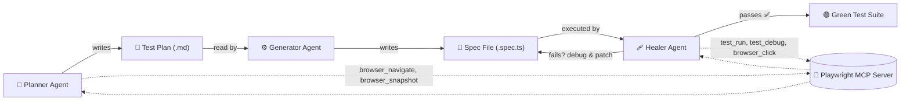

<p align="center">
  
</p>

<p align="center">
  
  
  
  
</p>

---

### 📋 Overview

Instead of writing every test by hand, this project sets up an AI coding agent (GitHub Copilot / Claude in VS Code) to:

| Step | Agent | Does |
|---|---|---|
| 1️⃣ | **Planner** | Explores the target app in a real browser and writes a structured test plan |
| 2️⃣ | **Generator** | Turns a plan item + seed file into an executable Playwright spec |
| 3️⃣ | **Healer** | Runs the suite, debugs failures (console/network/locators), and patches tests until green |

All three connect to one local **Playwright MCP server**, which exposes browser and test-runner actions as tools an agent can call. The repo includes a full working example of this loop against the **OrangeHRM demo site**.

---

### 🔄 How the Agent Loop Works



Every agent talks to the same MCP server (`npx playwright run-test-mcp-server`), which exposes actions like `browser_click`, `browser_navigate`, `browser_snapshot`, `test_run`, `test_debug`, and `test_list` as callable tools — that's the piece that lets an LLM actually *drive* a browser and a test runner instead of just generating text.

---

### 🧰 Tech Stack

<p align="center">
  
</p>

- 🎭 **[Playwright](https://playwright.dev/)** — end-to-end browser testing framework
- 🔷 **TypeScript** — test scripting language
- 🔌 **Playwright MCP Server** — exposes browser + test-runner actions as agent tools
- 🤖 **GitHub Copilot Agents** — custom `.agent.md` definitions for planner/generator/healer
- 🟩 **Node.js** — runtime environment

---

### 📁 Project Structure

```
Playwright-AI-Agents-Project
├── .github/
│   ├── agents/
│   │   ├── playwright-test-planner.agent.md    # Explores a site and writes a test plan
│   │   ├── playwright-test-generator.agent.md  # Turns a test plan item into a .spec.ts file
│   │   └── playwright-test-healer.agent.md     # Runs tests, debugs failures, fixes them
│   └── workflows/
│       └── copilot-setup-steps.yml             # CI setup steps for Copilot agent environment
├── .vscode/
│   └── mcp.json                                # VS Code MCP server config (playwright-test)
├── specs/
│   ├── README.md
│   ├── orangehrm-dashboard-test-plan.md         # AI-generated test plan for OrangeHRM dashboard
│   └── orangehrm-dashboard.spec.ts              # Generated test implementing the plan
├── tests/
│   ├── sample-agent-test.spec.ts               # Basic smoke test (example.com)
│   └── sample.test.spec.ts                     # Legacy expense-tracker test (add/delete expense)
├── seed.spec.ts                                # Empty seed used as starting point for agents
├── playwright.config.ts
├── package.json
└── package-lock.json
```

---

### ✅ Included Test Coverage

| File | Description |
|---|---|
| `specs/orangehrm-dashboard.spec.ts` | 🏢 Logs into the [OrangeHRM demo site](https://opensource-demo.orangehrmlive.com/), verifies dashboard loads with correct nav/widgets/profile area, checks invalid-login error |
| `tests/sample-agent-test.spec.ts` | 💨 Smoke test that `example.com` loads with expected title & heading |
| `tests/sample.test.spec.ts` | 💰 Legacy test — signs into an Expense Tracker app, creates/deletes an expense |
| `seed.spec.ts` | 🌱 Empty placeholder used as a seed for the generator agent |

---

### ⚙️ Configuration Highlights

<details>
<summary><b>playwright.config.ts settings (click to expand)</b></summary>
<br>

| Setting | Value |
|---|---|
| Test directory | `./tests` |
| Browser | Chrome (channel: `chrome`) |
| Headless mode | ❌ Disabled — visible browser |
| Slow motion | 1000ms delay between actions |
| Global timeout | 60 minutes |
| Per-test timeout | 2 minutes |
| Assertion timeout | 10s |
| Trace / Screenshot / Video | ✅ All enabled on every run |
| Reporter | HTML (`playwright-report/`) + console list |

</details>

---

### 🚀 Getting Started

**Prerequisites:** [Node.js](https://nodejs.org/) (LTS) · npm · VS Code + GitHub Copilot *(optional — only needed to run the agents, not the existing tests)*

```bash
# 1. Clone the repository
git clone https://github.com/vamsimappetti2001/Playwright-AI-Agents-Project.git
cd Playwright-AI-Agents-Project

# 2. Install dependencies
npm install

# 3. Install Playwright browsers
npx playwright install
```

### ▶️ Running Tests

```bash
npm test
# or
npx playwright test

# Run a specific spec
npx playwright test specs/orangehrm-dashboard.spec.ts

# View the HTML report
npx playwright show-report
```

### 🤖 Using the AI Agents (VS Code / GitHub Copilot)

1. Open the project in VS Code with GitHub Copilot enabled
2. The `playwright-test` MCP server is already configured in `.vscode/mcp.json`
3. Invoke the **planner**, **generator**, or **healer** agent (under `.github/agents/`) from Copilot Chat to plan new tests, generate specs from a plan, or auto-fix failing tests

---

### 🔐 Security Note — Action Required Before This Repo Is Public-Facing

> ⚠️ `tests/sample.test.spec.ts` contains a **hardcoded real email and password** for an external site.

Before linking this repo to any job application:
- [ ] Remove or replace this legacy test, or move credentials to environment variables loaded via `dotenv`
- [ ] Rotate the exposed password on the target account
- [ ] Add a `.gitignore` (currently missing) to exclude `node_modules/`, `test-results/`, `playwright-report/`, and `.playwright-mcp/` logs, which are currently committed

---

### 🧪 Why This Repo Matters for a QA Role

This isn't just "I used Copilot to write tests" — it's a working answer to a question most QA teams are only starting to ask: *where do AI agents actually fit into a test lifecycle?*

- 🧭 **Planning is externalized and reviewable** — the planner writes a Markdown test plan *before* any code exists, so a human can review test intent, not just test code
- 🩹 **Healing is debugging, not guessing** — the healer inspects real console/network/locator state before patching, the same workflow a human would follow
- 🔌 **Built on an open protocol (MCP)**, not a closed tool — the same pattern generalizes to any agent, any framework
- 🔍 **Security-aware, not just feature-aware** — I found and documented the credential issue above myself, which is the instinct I'd bring to reviewing anyone's test suite, AI-generated or not

---

### 👤 Author

**Vamsi Mappetti** · QA / Test Automation Engineer
📍 Bengaluru, India &nbsp;|&nbsp; 🔗 [@vamsimappetti2001](https://github.com/vamsimappetti2001)


