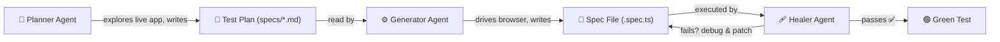

<p align="center">
  
</p>

<p align="center">
  
  
  
</p>

---

### 📋 Overview

This project automates the key user flows of a live, deployed app — the **[Nest.js Expense Tracker](https://nest-js-expense-tracker.vercel.app/)** — to verify it behaves correctly from a real end user's perspective.

The suite now has two layers, built two different ways:

| | Original Suite | AI-Planned Suite |
|---|---|---|
| **How it was built** | Hand-written | Planner agent explored the live app → wrote test plans → generator agent turned them into specs |
| **What it covers** | Core happy-path flows: sign in, navigate, add/delete an expense | Validation, access control, and edge cases: invalid credentials, weak passwords, unauthenticated access, form validation, confirmation/cancellation flows |
| **Where it lives** | `tests/*.spec.ts` (root of `tests/`) | `tests/auth/…` and `tests/auth/new/…` |

> 🆕 **New to this repo, or new to Playwright entirely?** This README explains not just *what* exists, but *what it means* and *why it's there* — no prior context needed.

---

### 🧰 Tech Stack

<p align="center">
  
</p>

| Tool | What it is | Why it's used here |
|---|---|---|
| 🎭 **[Playwright](https://playwright.dev/)** | A browser-automation framework — drives a real browser and asserts what should be on screen | Runs every test in this repo, end to end |
| 🔷 **TypeScript** | JavaScript with type-checking added on top | Catches mistakes before a test even runs |
| 🟩 **Node.js** | The JavaScript runtime | Required to install and run Playwright at all |
| 🔌 **Playwright MCP Server** | Exposes browser + test-runner actions as tools an AI agent can call | Powers the planner/generator/healer workflow below |

---

### 🤖 How the New AI-Planned Suite Was Built


```mermaid
flowchart LR
    A["🧭 Planner Agent"] -->|"explores live app, writes"| B["📄 Test Plan (specs/*.md)"]
    B -->|"read by"| C["⚙️ Generator Agent"]
    C -->|"drives browser, writes"| D["🧪 Spec File (.spec.ts)"]
    D -->|"executed by"| E["🩹 Healer Agent"]
    E -->|"fails? debug & patch"| D
    E -->|"passes ✅"| F["🟢 Green Test"]
```

Both agents connect to a local **Playwright MCP server** (`.vscode/mcp.json` → `npx playwright run-test-mcp-server`), which exposes actions like `browser_click`, `browser_navigate`, `browser_snapshot`, and `test_run`/`test_debug` as callable tools. The planner actually visits `/signin`, `/expenses`, `/budgets`, `/categories`, `/profile`, and `/dashboard` in a real browser before writing a plan — it doesn't guess at what fields exist, it inspects them (see the "Application Overview" note at the top of each file in `specs/`).

---

### 📁 Project Structure (Updated)

```
Expense-Tracker-Automation-Playwright-
├── .github/agents/                          # Planner / Generator / Healer agent definitions
├── .vscode/mcp.json                         # Local Playwright MCP server config
├── specs/                                    # AI-generated test PLANS (not all implemented yet — see below)
│   ├── expense-tracker-dashboard-test-plan.md
│   ├── expenses-page-test-plan.md
│   ├── budgets-page-test-plan.md
│   ├── categories-page-test-plan.md
│   ├── dashboard-website-test-plan.md
│   └── profile-page-test-plan.md
├── seed.spec.ts                              # Empty seed file used as a generator starting point
├── e2e/
│   └── example.spec.ts                       # Default Playwright starter test (2nd copy)
├── tests/
│   ├── Signin.spec.ts                        # 🧑‍💻 Hand-written: sign-in flow
│   ├── Signin_Expenses.spec.ts                # 🧑‍💻 Hand-written: sign-in + navigate to Expenses
│   ├── Addexpense_deleteexpense_test.spec.ts   # 🧑‍💻 Hand-written: create and delete an expense
│   ├── 01_Test.spec.ts                        # (empty / placeholder)
│   ├── example.spec.ts                        # Default Playwright starter test
│   ├── auth/
│   │   ├── Signin page test cases/            # 🤖 AI-generated: 7 sign-in/sign-up specs
│   │   └── new/Expenses page Test Cases/       # 🤖 AI-generated: 8 expenses-page specs
├── .env.example                               # Template — EXPENSE_TRACKER_EMAIL / EXPENSE_TRACKER_PASSWORD
├── playwright.config.ts
├── package.json
└── .gitignore
```

> 💡 **New to Playwright projects?** A "spec" file (short for *specification*) is a file containing one or more tests — `.spec.ts` is the naming convention Playwright looks for automatically. A "test plan" (the `.md` files in `specs/`) is a **human-readable document written before any test code** — it describes what should be tested and why, so a person can review intent before reviewing implementation.

---

### ✅ Test Coverage — Original Hand-Written Suite

<details>
<summary><b>🔑 <code>Signin.spec.ts</code> — Sign-in flow</b></summary>
<br>

**Step by step:**
1. Opens the app's login page
2. Fills in email and password
3. Clicks sign in
4. Asserts the app lands on the logged-in view

</details>

<details>
<summary><b>🧾 <code>Signin_Expenses.spec.ts</code> — Sign-in + navigation</b></summary>
<br>

**Step by step:**
1. Repeats the sign-in flow
2. Navigates to the Expenses section
3. Asserts the Expenses page has loaded

</details>

<details>
<summary><b>➕ <code>Addexpense_deleteexpense_test.spec.ts</code> — Create & delete an expense</b></summary>
<br>

**Step by step:**
1. Signs in → navigates to Expenses → opens the add-expense form
2. Fills **amount**, **description**, selects **category** → submits
3. Asserts the new expense appears in the list
4. Deletes it, then asserts it's gone

*This test leaves the app in the state it found it — no lingering test data.*

</details>

---

### 🤖 Test Coverage — AI-Planned Suite (New)

These specs came from the planner exploring the real, live signed-out and authenticated app and documenting exactly what it found — including validation rules like the exact password policy text.

<details open>
<summary><b>🔐 Auth — 7 specs, in "Signin page test cases/"</b></summary>
<br>

| Spec | What it checks |
|---|---|
| `signin-success.spec.ts` | Signs in with a real test account and confirms the authenticated nav (`Expenses` link) appears |
| `signin-invalid-credentials.spec.ts` | Wrong credentials produce an error and no session |
| `signin-validation.spec.ts` | Empty/partial sign-in submissions are rejected, required fields enforced |
| `signup-invalid-email.spec.ts` | Malformed email is rejected on sign-up |
| `signup-password-mismatch.spec.ts` | Password and confirm-password fields must match |
| `signup-validation.spec.ts` | Required sign-up fields are enforced |
| `signup-weak-password.spec.ts` | A password like `weak` is rejected, and the exact policy text ("At least 6 characters with uppercase, lowercase, and number/special character") is asserted as visible |

</details>

<details open>
<summary><b>🧾 Expenses — 8 specs, in "auth/new/Expenses page Test Cases/"</b></summary>
<br>

| Spec | What it checks |
|---|---|
| `unauthenticated-access.spec.ts` | Visiting `/expenses` with no session redirects to sign-in — even after reload and browser Back |
| `create-expense-persistence.spec.ts` | A created expense survives a page reload |
| `delete-expense-confirmation.spec.ts` | Deleting an expense requires/handles confirmation correctly |
| `category-choice-cancellation.spec.ts` | Cancelling a category selection doesn't leave the form in a broken state |
| `expense-form-validation.spec.ts` | Invalid amounts/descriptions are rejected by the add-expense form |
| `expenses-list-states.spec.ts` | Empty and populated list states render correctly |
| `expense-request-reliability.spec.ts` | The expense-creation request behaves reliably (e.g. no duplicate submissions) |
| `manual-page-discovery-accessibility-review.spec.ts` | Marked `test.skip()` — flagged as needing a **human**, not automation (screen-reader and mobile-layout review) |

> 💡 That last one is worth noting in an interview: the planner correctly identified that *not everything should be automated* — accessibility review needs a human, and the spec says so explicitly instead of faking a shallow automated check.

</details>

<details>
<summary><b>📝 Planned but not yet implemented: Budgets, Categories, Profile, full Dashboard</b></summary>
<br>

`specs/budgets-page-test-plan.md`, `categories-page-test-plan.md`, and `profile-page-test-plan.md` exist as full written plans — but no corresponding `tests/budgets/`, `tests/categories/`, or `tests/profile/` spec files exist yet. This is intentional, documented scope: the categories and profile plans explicitly note the authenticated UI "was not inspectable" without a dedicated staging account, so the plan marks those scenarios **conditional** rather than guessing at selectors that might not exist.

</details>

---

### ⚙️ Configuration Highlights

<details>
<summary><b>playwright.config.ts settings — click to expand, with plain-English explanations</b></summary>
<br>

| Setting | Value | What this means in practice |
|---|---|---|
| Test directory | `./tests` | Playwright only looks inside this folder for `.spec.ts` files |
| Browser | Chromium (Desktop Chrome) | Tests run in a Chrome-based engine |
| Headless mode | ❌ Disabled | A real, visible browser window pops up while tests run |
| Trace / Screenshot / Video | ✅ All enabled | Full run artifacts saved for debugging any failure |
| Slow motion | 1000ms delay between actions | Makes the browser easier to watch with the naked eye |
| Timeout | 60 seconds per test (90s for sign-in, set inline) | Prevents a hung test from blocking the suite forever |
| Reporter | HTML report | Results compiled into a browsable report after each run |

</details>

---

### 🚀 Getting Started (Complete Beginner Walkthrough)

**Prerequisites:** [Node.js](https://nodejs.org/) (LTS) · npm

<details open>
<summary><b>Step-by-step setup — click to expand</b></summary>
<br>

**1. Clone the repository**
```bash
git clone https://github.com/vamsimappetti2001/Expense-Tracker-Automation-Playwright-.git
cd Expense-Tracker-Automation-Playwright-
```

**2. Install dependencies**
```bash
npm install
```

**3. Install Playwright's browsers** *(one-time per machine)*
```bash
npx playwright install
```

**4. Set up your test credentials**
```bash
cp .env.example .env
# then edit .env and fill in EXPENSE_TRACKER_EMAIL and EXPENSE_TRACKER_PASSWORD
```
*This is the file the sign-in tests are **meant** to read from — see the Security Note below for the one spec that currently bypasses this.*

</details>

### ▶️ Running Tests

```bash
# Run every test in the suite
npx playwright test

# Run just the AI-planned auth suite
npx playwright test "tests/auth/Signin page test cases"

# Run just the AI-planned expenses suite
npx playwright test "tests/auth/new/Expenses page Test Cases"

# Run tests with Playwright's interactive UI (great for beginners)
npx playwright test --ui

# View the HTML report from the last run
npx playwright show-report
```

> ⚠️ Note: `package.json` currently has no `npm test`/`npm run report` shortcuts defined — use the `npx playwright ...` commands above directly.

---

### 🆘 Troubleshooting (Common First-Run Issues)

<details>
<summary><b>Click to expand common problems and fixes</b></summary>
<br>

| Problem | Likely Cause | Fix |
|---|---|---|
| `npx: command not found` | Node.js isn't installed | Install from [nodejs.org](https://nodejs.org/), reopen your terminal |
| Browser fails to launch | Playwright's browsers weren't installed | Run `npx playwright install` |
| Sign-in tests fail immediately | `.env` isn't set up, or the test account changed | Check `.env` against `.env.example`; note `signin-success.spec.ts` currently ignores `.env` — see Security Note |
| Tests time out on the live site | The deployed app is slow or down | Re-run; check it loads normally in a regular browser first |
| `npm test` says "missing script" | No test scripts are defined in `package.json` | Use `npx playwright test` directly instead |

</details>

---

### 🔐 Security Note — Urgent Action Required

> 🚨 **`tests/auth/Signin page test cases/signin-success.spec.ts` contains a real, working email and password hardcoded in plaintext.** This is currently visible to anyone who views this public repository.

**Do this now, not just eventually:**
- [ ] **Change that password immediately** on the actual account — treat it as compromised the moment it was pushed publicly
- [ ] Rewrite `signin-success.spec.ts` to read `process.env.EXPENSE_TRACKER_EMAIL` / `EXPENSE_TRACKER_PASSWORD` instead of the literal strings — your own `.env.example` already shows this is the intended pattern, it's just not wired up in this one file
- [ ] Remove the credentials from git history (not just the latest commit) — GitHub's [guide on removing sensitive data](https://docs.github.com/en/authentication/keeping-your-account-and-data-secure/removing-sensitive-data-from-a-repository) or `git filter-repo` can do this
- [ ] Add `.playwright-mcp/` to `.gitignore` — its debug logs and page snapshots (containing page content from test runs) are currently committed to the repo too

---

### 📌 Notes

- `01_Test.spec.ts` and `tests/example.spec.ts` / `e2e/example.spec.ts` are scaffolding leftovers, safe to remove once you're confident in the custom suite
- Two copies of the default starter test now exist (`tests/example.spec.ts` and `e2e/example.spec.ts`) — worth consolidating to one

---

### 📖 Glossary (For Anyone New to This Workflow)

<details>
<summary><b>Click to expand</b></summary>
<br>

| Term | Meaning |
|---|---|
| **E2E (End-to-End) test** | A test that drives the app the way a real user would, rather than testing one function in isolation |
| **Test plan** | A human-readable document (here, the `.md` files in `specs/`) describing what should be tested, written *before* test code exists |
| **MCP (Model Context Protocol)** | An open protocol letting an AI agent call real tools — like browser actions or a test runner — instead of just generating text |
| **Planner / Generator / Healer** | Three roles in this project's AI workflow: explore & document → write executable tests → run, debug, and fix failures |
| **`test.skip()`** | Playwright's way of marking a test as intentionally not run, with a reason — used here for a scenario that needs a human, not automation |
| **Locator** | Playwright's way of finding an element on the page before interacting with it |

</details>

---

### 👤 Author

**Vamsi Mappetti** · QA / Test Automation Engineer
📍 Bengaluru, India &nbsp;|&nbsp; 🔗 [@vamsimappetti2001](https://github.com/vamsimappetti2001)


